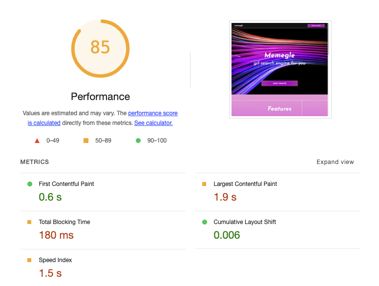
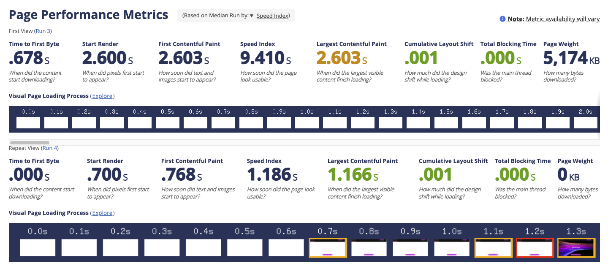
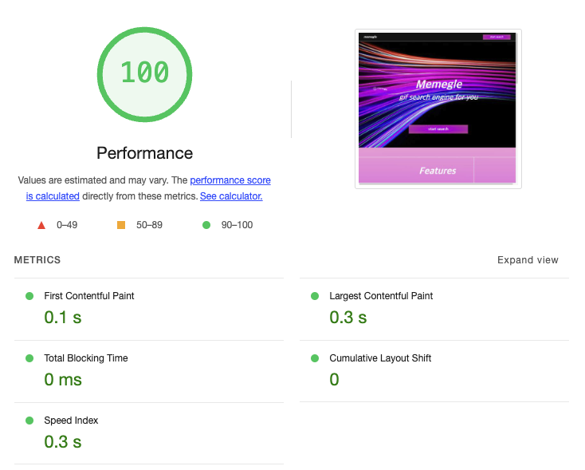
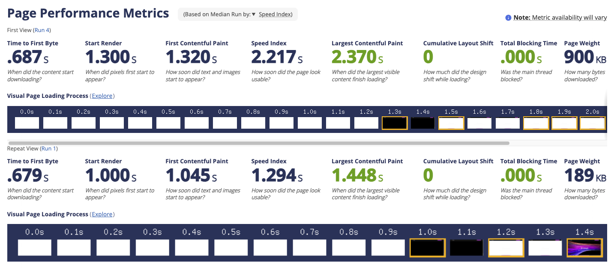

## 🔥 결과

### 배포한 CloudFront 접근 경로

[🚀 개선 사이트](https://doyts9o3bxwvh.cloudfront.net/)

### 개선 전후 성능 측정 결과

<table>
  <thead>
    <tr>
      <th align="center">버전</th>
      <th align="center">Lighthouse</th>
      <th align="center">WebPageTest</th>
    </tr>
  </thead>
  <tbody>
    <tr>
      <th><a href="https://llqqssttyy.github.io/perf-basecamp/">🔗 개선 전</a></th>
      <td></td>
      <td></td>
    </tr>
    <tr>
      <th><a href="https://doyts9o3bxwvh.cloudfront.net/">🔗 개선 후</a></th>
      <td></td>
      <td></td>
    </tr>
  </tbody>
</table>

<br/>

## ✅ 개선 작업 목록

**1 요청 크기 줄이기**

- [x] 소스코드 크기 줄이기

  - JS Minify는 webpack v5에서 자동으로 적용되므로 별도의 설정은 하지 않았습니다.
  - `MiniCssExtractPlugin`으로 prod 버전에서 CSS 코드를 bundle.js와 분리했습니다.
  - `CssMinimizerPlugin`으로 추출된 파일을 Minify 해주었습니다.

- [x] 이미지 크기 줄이기
  - png 이미지는 jpg와 webp로, gif는 mp4와 webm으로 변환했습니다.
  - 기본적으로 webp, webm을 렌더링하고, 해당 형식을 지원하지 않는 브라우저는 jpg, gif를 보여주도록 했습니다.
  - 이미지 변환은 ImageMagick webpack의 `ImageMinimizerWebpackPlugin`으로, mp4와 webm은 ffmpeg cli로 수동 압축했습니다.
  - 디스플레이 크기에 따라 적절한 hero 이미지를 받아오도록 srcSet 설정을 했습니다.

<br/>

**2 필요한 것만 요청하기**

- [x] 페이지별 리소스 분리
  - Route에 들어가는 페이지를 동적 import로 변경해 리소스를 분리했습니다.
- [x] 아이콘 패키지 Tree Shaking
  - webpack은 기본적으로 사용되는 모듈만 번들링되므로 별도의 설정을 해주진 않았습니다.

<br/>

**3 같은 건 매번 새로 요청하지 않기**

- [x] CloudFront 캐시 설정 / S3 메타데이터 설정 (설정값, 해당 값을 설정한 이유 포함)
  - CloudFront의 캐시 정책을 ['CachingOptimized'](https://docs.aws.amazon.com/AmazonCloudFront/latest/DeveloperGuide/ServingCompressedFiles.html?icmpid=docs_console_unmapped#compressed-content-cloudfront-notes)로 설정해 크기가 큰 오브젝트는 Gzip으로 자동 전송되게 했습니다.
  - 재방문 시 페이지 로딩 속도를 향상시키기 위해서 S3의 모든 오브젝트에 `Cache-Control` 메타데이터를 추가해 캐싱이 되도록 했습니다. max-age는 1일입니다.
- [x] GIPHY의 trending API를 Search 페이지에 들어올 때마다 새로 요청하지 않아야 한다.
  - Cache API를 사용해 응답을 캐싱하도록 했습니다.
  - url을 키로 하여 캐시된 데이터가 존재하면 요청을 보내지 않습니다.
  - stale time은 1시간입니다.

<br/>

**4 최소한의 변경만 일으키기**

- [x] 검색 결과 > 추가 로드시 추가된 목록만 새로 렌더되어야 한다.
  - `GiftList`와 `GifItem` 컴포넌트를 메모이제이션해 추가된 목록만 렌더되도록 했습니다.
- [x] Layout Shift 없이 애니메이션이 일어나야 한다.
  - `CustomCursor`와 `HelpPanel` 컴포넌트에서 layout shift가 일어나지 않도록 transform 속성이 변하도록 수정했습니다.
- [x] Frame Drop이 일어나지 않아야 한다.

  - (Chrome DevTools 기준) Partially Presented Frame 역시 최소로 발생해야 한다.

  

<br/>

## 🧐 공유

### Cache API를 사용한 이유?

> GIPHY의 trending API를 Search 페이지에 들어올 때마다 새로 요청하지 않아야 한다.

위 요구사항을 두 가지 방식으로 구현할 수 있다고 생각했습니다.

- 컴포넌트 외부에 const 변수를 두어 렌더링에 영향을 받지 않도록 설정.
- 브라우저 스토리지 또는 Cache API를 사용하여 React 외부에서 캐싱.

1번 방법은 새로고침 시 다시 fetch가 발생하는 반면, Cache API를 사용하면 stale time을 설정하여 브라우저를 나갔다가 다시 돌아와도 캐시가 유지됩니다.

또한 Cache API는 Local Storage와 다르게 response를 통째로 저장하므로 대용량 리소스를 저장하거나 헤더를 활용할 수 있다는 사실을 알았고, 이러한 이유로 Cache API를 선택해 구현했습니다.

<br/>

---

### Trouble Shooting

CacheManager 클래스를 구현하면서 다음과 같은 에러를 마주했습니다.

```shell
Uncaught (in promise) TypeError: Failed to execute 'json' on 'Response': body stream already read
```

이 에러는 Response 객체의 본문(body)이 ReadableStream이기 때문에 발생합니다. ReadableStream은 데이터 스트림을 한 번만 읽을 수 있는 일회성 객체입니다. 즉, 한 번 response.json()으로 본문을 읽으면 그 스트림은 소진되며 이후 다시 읽을 수 없게 됩니다.

문제가 된 코드를 보면, cacheResponse 함수에서 Response 객체를 캐싱한 후에 다시 response.json()으로 본문을 읽으려고 시도하면서 에러가 발생했습니다.

```ts
// CacheManager.ts
async cacheResponse(cacheKey: string, response: Response): Promise<void> {
  // ...
  await this.cacheStorage.put(cacheKey, response);
}

// apiClient.ts
await cacheManager.cacheResponse(cacheKey, response);
return response.json(); // 에러 발생
```

cacheResponse에서 Response를 그대로 캐시로 저장한 후 다시 읽으려고 할 때, 이미 본문이 읽혔기 때문에 스트림이 소진된 상태라 json() 메서드가 실패합니다.

#### 해결 방법

response.clone()을 사용하면 같은 내용을 가진 새로운 Response 객체를 생성하도록 변경했습니다. 이렇게 하면 하나는 캐시로 저장하고, 다른 하나는 본문을 읽는 데 사용할 수 있습니다.

```ts
// CacheManager.ts
async cacheResponse(cacheKey: string, response: Response): Promise<void> {
  // ...
  await this.cacheStorage.put(cacheKey, response.clone());
}
```

### 왜 fetch Response는 stream인가?

스트림(Stream)은 데이터를 작은 조각으로 나눠서 순차적으로 전달하고 처리하는 방식입니다. 데이터를 한꺼번에 메모리에 로드하지 않고, 필요할 때마다 읽고 처리할 수 있어 메모리 효율성이 높고, 네트워크나 I/O 작업에서 실시간 처리가 가능합니다.

Response를 stream으로 설계하면 대용량 데이터를 한 번에 메모리에 적재하지 않아도 되니 리소스를 절약할 수 있고, 데이터의 일부만 전송되어도 순차 처리 및 렌더링을 할 수 있게 됩니다.
