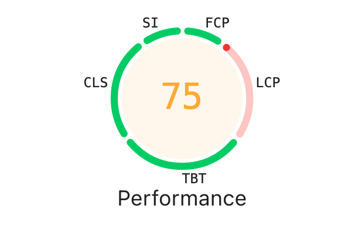
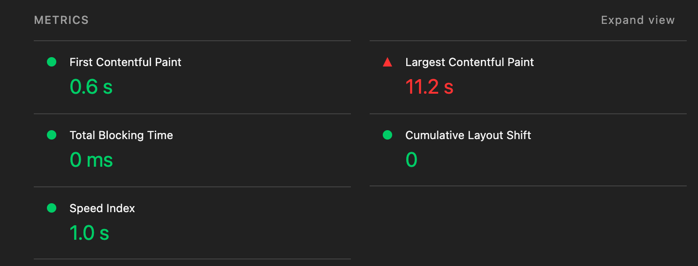

# Memegle 성능 리포트 (개선 전)

> 작성일: 2026-09-16
> 대상 커밋: `3078002`
> 측정 URL: https://geongyu09.github.io/perf-basecamp

## 1. 측정 환경

| 항목 | 값 |
| --- | --- |
| 브라우저 | Chrome (버전 기입) / 시크릿 모드 |
| Lighthouse | DevTools 내장, Navigation 모드, Mobile 프리셋 |
| 스로틀링 | CPU 6x slowdown, Network Fast 3G |
| 캐시 | 첫 로드: Disable cache / 반복 로드: 캐시 유지 |
| WebPageTest | Paris - EC2, Chrome, Fast 3G, CPU 6x, First View + Repeat View |
| 측정 횟수 | 3회 측정 후 중앙값 기록 |

측정 절차는 아래 문서를 따른다. 개선 후 측정도 같은 절차로 진행한다.

- [Lighthouse 측정 절차](./measure-lighthouse.md)
- [Network 리소스 측정 절차](./measure-network.md)

## 2. 요약 (목표 vs 현재)

| 항목 | 목표 | 현재 | 달성 |
| --- | --- | --- | --- |
| Lighthouse Performance | ≥ 95 | 75 (Home) | ❌ |
| Home 스크립트 리소스 크기 | < 60kb | 319kb (gzip 전송 기준, 원본 1,239kb) | ❌ |
| 히어로 이미지 크기 | < 120kb | 10,671kb (원본 `hero.png`) | ❌ |
| Home 2회차 이후 LCP (Paris, Fast 3G) | < 1.2s | | ❌ |
| Dropped Frame / Partially Presented Frame | 0 / 최소 | | ❌ |

## 3. 로딩 성능 상세

### 3-1. Lighthouse (Home)

측정 방법: [measure-lighthouse.md](./measure-lighthouse.md)

| 지표 | 값 |
| --- | --- |
| Performance | 75 |
| FCP | 0.6 s |
| LCP | 11.2 s |
| TBT | 0 ms |
| CLS | 0 |
| Speed Index | 1.0 s |

- LCP만 빨간색(개선 필요) 구간이고 FCP, SI, TBT, CLS는 초록색 구간이다. 점수 하락의 주원인은 LCP다.
- FCP 0.6s 대비 LCP가 11.2s로, 첫 페인트 이후 가장 큰 요소(히어로 이미지)가 그려지기까지 10초 이상 걸린다. 스크립트 실행(TBT 0ms)이 아니라 리소스 다운로드가 병목이다.

- Lighthouse 원본 JSON: `docs/lighthouse/home-before.json`

### 3-2. Lighthouse (Search)

| 지표 | 값 |
| --- | --- |
| Performance | |
| FCP | |
| LCP | |
| TBT | |
| CLS | |
| Speed Index | |

### 3-3. Network 리소스 내역 (Home 첫 로드)

측정 방법: [measure-network.md](./measure-network.md)

| 종류 | 요청 수 | 전송 크기 | 원본 크기 | 압축(gzip/br) 여부 | 비고 |
| --- | --- | --- | --- | --- | --- |
| HTML | 1 | 0.7 kB | 0.6 kB | gzip | `index.html` |
| JS | 1 | 319 kB | 1,239 kB | gzip (약 74% 감소) | 단일 번들 `bundle.js`. Search 페이지 코드 포함됨 |
| CSS | 1 | 0.6 kB | 5.2 kB | gzip | Google Fonts CSS (`Josefin Sans`) |
| 이미지 | 4 | 15,620 kB | 15,610 kB | 없음 | hero.png 10,678 kB, find.gif 1,987 kB, free.gif 1,694 kB, trending.gif 1,260 kB |
| 폰트 | 2 | 59.8 kB | 59.7 kB | 없음 (woff2 자체 압축) | Google Fonts woff2 2개 |
| 기타 | 1 | 1.1 kB | 4.3 kB | gzip | favicon.ico |
| 합계 | 10 | 16,000 kB | 16,919 kB | | DOMContentLoaded 294ms / Load 2.56s / Finish 2.66s (스로틀링 없음) |

- 전송량의 97.6%(15,620 kB / 16,000 kB)가 이미지다. JS, CSS는 gzip이 적용되어 있지만 이미지는 압축이 전혀 안 되어 전체 전송량 대비 압축 효과가 0.9 MB에 그친다.
- JS 번들은 압축 후 319 kB로 목표(60 kB)의 5배 이상이다. 원본 1,239 kB 단일 번들이므로 Code Splitting과 Tree Shaking이 필요하다.
- 폰트 2개 59.8 kB는 개선 대상은 아니지만, 이미지 개선 후에는 상대적으로 비중이 커지므로 서브셋 여부를 검토할 수 있다.

**개별 요청 (응답 시간 순)**

| 파일 | 전송 크기 | 응답 시간 |
| --- | --- | --- |
| `hero.png` | 10,678 kB | 2,258 ms |
| `free.gif` | 1,694 kB | 1,719 ms |
| `find.gif` | 1,987 kB | 1,643 ms |
| woff2 ×2 | 28.7 kB + 31.1 kB | 1,067 ms / 1,000 ms |
| `trending.gif` | 1,260 kB | 313 ms |
| `bundle.js` | 319 kB | 153 ms |

- `hero.png` 하나가 Load 2.56s 중 2.26s를 차지한다. LCP 요소가 이 이미지이므로 Lighthouse LCP 11.2s(Fast 3G)와 직결된다.
- HAR 원본: `docs/network/home-before.har`

### 3-4. 번들 구성

- Home 진입 시 로드되는 청크: 단일 번들 1개 (319 kB 전송 / 1,239 kB 원본)
- Search 페이지 코드 포함 여부: 포함됨. 번들 내에서 `SearchResult` 35회, `HelpPanel` 40회, `trending` 6회 검출. Home에서는 쓰이지 않는 코드다.
- react-icons 포함 범위: `react-icons/ai` 패키지 전체가 포함됨. 번들에서 `GenIcon` 호출 791개, 아이콘 이름 789개 검출. 실제 사용 아이콘은 3개(`AiOutlineSearch`, `AiOutlineInfo`, `AiOutlineClose`)뿐이다.
- webpack-bundle-analyzer 결과:

### 3-5. 빌드 설정과 이미지 원본 현황 (요청 크기 줄이기 기준선)

**빌드 설정 (`webpack.config.js`)**

| 항목 | 현재 값 | 영향 |
| --- | --- | --- |
| `optimization.minimize` | `false` | 프로덕션 빌드에서도 minify가 꺼져 있다. 배포된 `bundle.js`는 13,561줄, 주석과 공백이 그대로다 |
| `devtool` | `source-map` | 프로덕션에도 소스맵 파일이 함께 배포된다 |
| `output.filename` | `bundle.js` | 해시가 없어 장기 캐시 불가 |
| CSS 처리 | `style-loader` + `css-loader` | CSS가 JS 번들 안에 문자열로 포함된다 (별도 CSS 파일 없음) |
| 이미지 처리 | `file-loader`, 변환 없음 | 원본 png/gif가 그대로 복사된다 |
| gzip | 빌드 단계 없음 | 현재 압축은 GitHub Pages가 응답 시 적용한 것. CloudFront로 옮기면 별도 설정 필요 |

**이미지 원본 vs 표시 크기**

| 파일 | 포맷 | 원본 픽셀 | 파일 크기 | 표시 크기 (CSS) | 비고 |
| --- | --- | --- | --- | --- | --- |
| `hero.png` | PNG | 4100 × 2735 | 10,672 kB | 뷰포트 너비 × 744px (`46.5rem`) | 1920px 화면 기준 2배 이상 큰 원본. 사진이라 PNG 무손실이 불필요 |
| `find.gif` | GIF | 720 × 405 | 1,985 kB | 높이 기준 `.featureImage` 카드에 맞춤 | 애니메이션 GIF |
| `free.gif` | GIF | 480 × 360 | 1,693 kB | 위와 동일 | 애니메이션 GIF |
| `trending.gif` | GIF | 540 × 304 | 1,259 kB | 위와 동일 | 애니메이션 GIF |

- 히어로 이미지 목표 120 kB를 맞추려면 포맷 변환(WebP/AVIF)과 리사이즈를 함께 해야 한다. 표시 폭이 뷰포트 100%이므로 1920px 또는 반응형 `srcset`이 기준이 된다.
- GIF 3개는 총 4,937 kB로 히어로 다음으로 크다. 애니메이션이므로 WebP 애니메이션 또는 `<video>` 태그(MP4/WebM)로 바꾸는 것이 효과가 크다.

### 3-6. WebPageTest (Paris, Fast 3G)

| 구분 | LCP | TTFB | Fully Loaded | 비고 |
| --- | --- | --- | --- | --- |
| First View | | | | |
| Repeat View | | | | 캐시 히트 여부: |

- 결과 URL:

## 4. 캐싱과 재요청

### 4-1. 정적 리소스 캐시 헤더

확인 방법: [measure-network.md](./measure-network.md) 4번 항목

| 리소스 | Cache-Control | 비고 |
| --- | --- | --- |
| `index.html` | `max-age=600` | GitHub Pages 기본값 |
| `bundle.js` | `max-age=600` | 파일명에 해시가 없어 장기 캐시를 걸 수도 없는 상태 |
| 이미지 (png, gif) | `max-age=600` | 10분 뒤 재방문 시 15.6 MB 전부 재다운로드 |
| Google Fonts CSS | `private, max-age=86400` | 외부 리소스 |
| Google Fonts woff2 | `public, max-age=31536000` | 외부 리소스, 1년 캐시 |

- GitHub Pages는 모든 정적 파일에 `max-age=600`을 일괄 적용하고 변경할 수 없다. CloudFront + S3로 옮겨야 리소스별 캐시 정책을 설정할 수 있다.

### 4-2. GIPHY trending API 호출

| 시나리오 | 호출 횟수 |
| --- | --- |
| Search 페이지 최초 진입 | |
| Home → Search 재진입 (3회 반복) | |

## 5. 런타임(렌더링) 성능

### 5-1. 애니메이션 프레임 (Home, CPU 6x)

| 항목 | 값 |
| --- | --- |
| Dropped Frames | |
| Partially Presented Frames | |
| 측정 구간 | (예: 히어로 섹션 스크롤 애니메이션 5초) |

### 5-2. Layout Shift

| 발생 위치 | CLS 기여도 | 원인 추정 |
| --- | --- | --- |
| | | |

### 5-3. React Profiler (검색 결과 추가 로드)

| 항목 | 값 |
| --- | --- |
| 추가 로드 시 리렌더된 컴포넌트 수 | |
| 기존 목록 아이템 리렌더 여부 | |

## 6. 병목 원인 분석

| 관측된 현상 | 추정 원인 | 관련 파일 |
| --- | --- | --- |
| LCP 지연 | 히어로 이미지 원본(10.6MB PNG) 그대로 로드 | `src/assets/images/hero.png` |
| 초기 JS 크기 과다 (319 kB) | minify 꺼짐(`minimize: false`), 단일 번들에 Search 페이지 코드 포함, `react-icons/ai` 약 790개 아이콘 중 3개만 사용 | `webpack.config.js`, `src/App.tsx`, `src/pages/Search/components/*` |
| 이미지 전송량 과다 | GIF 원본(1.2~2MB) 3개를 Home에서 로드, 이미지 변환 파이프라인 없음 | `src/assets/images/*.gif`, `webpack.config.js` |
| 반복 로드 시 개선 없음 | GitHub Pages 고정 `max-age=600`, 번들 파일명에 해시 없음, CDN 미적용 | 배포 설정, `webpack.config.js` output |
| Search 재진입 시 API 재호출 | trending 결과 메모이제이션 없음 | `src/pages/Search` |
| 프레임 드롭 | (Performance 탭 확인 후 기입) | |

## 7. 개선 계획

| 우선순위 | 작업 | 대응 원인 | 기대 효과 |
| --- | --- | --- | --- |
| 1 | 히어로 이미지 WebP/AVIF 변환 및 리사이즈 | LCP 지연 | LCP, Performance 점수 |
| 2 | GIF → WebP/MP4 변환 | 이미지 전송량 | 전송 크기 |
| 3 | 페이지별 Code Splitting (React.lazy) | 초기 JS 크기 | Home 스크립트 < 60kb |
| 4 | react-icons Tree Shaking (개별 import) | 초기 JS 크기 | 번들 크기 |
| 5 | minify / gzip / brotli | 초기 JS 크기 | 전송 크기 |
| 6 | S3 + CloudFront, Cache-Control 설정 | 반복 로드 | 2회차 LCP < 1.2s |
| 7 | trending API 메모이제이션 | API 재호출 | 요청 수 |
| 8 | 애니메이션 transform/opacity 전환, 이미지 크기 명시 | 프레임 드롭, CLS | Frame Drop 0 |
| 9 | 목록 아이템 React.memo / key 점검 | 불필요 리렌더 | 렌더 범위 최소화 |
