# 성능 측정 보고서

## LigthHouse - 성능

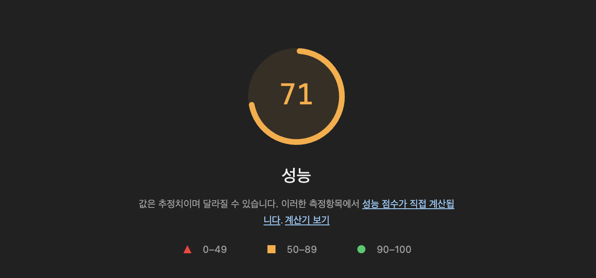

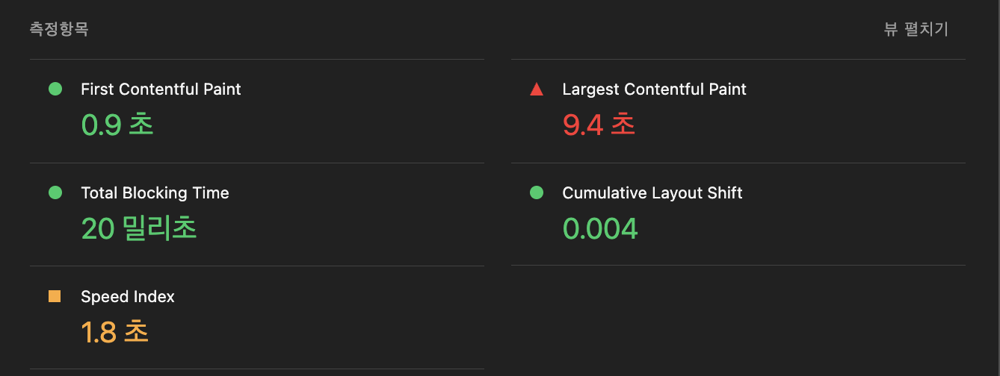

### 개선 사항

#### 1. 자바스크립트 줄이기

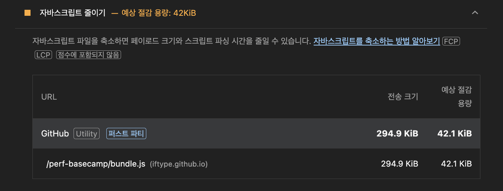

```js
optimization: {
  // 변경 전
  // minimize: false;
  minimize: true;
}
```

위 설정은 빌드 시 Javascript를 압축하지 않도록 하는 설정이기 때문에 true로 변경하여 공백, 줄바꿈 등을 줄였다.

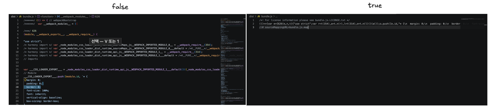

- 변경 전

```bash
❯ ls -lh dist/bundle.js
gzip -c dist/bundle.js | wc -c
-rw-r--r--@ 1 iftype  staff   1.2M Sep 17 16:48 dist/bundle.js
  313504
```

- 변경 후

```bash
❯ ls -lh dist/bundle.js
gzip -c dist/bundle.js | wc -c
-rw-r--r--@ 1 iftype  staff   225K Sep 17 16:43 dist/bundle.js
   70496
```

용량은 1.2M에서 225K까지 줄게 됐으며, 빌드 산출물인 `bundle.js`를 확인하여 그 변경점을 확인할 수 있다.

#### 2. 사용하지 않는 자바스크립트 줄이기

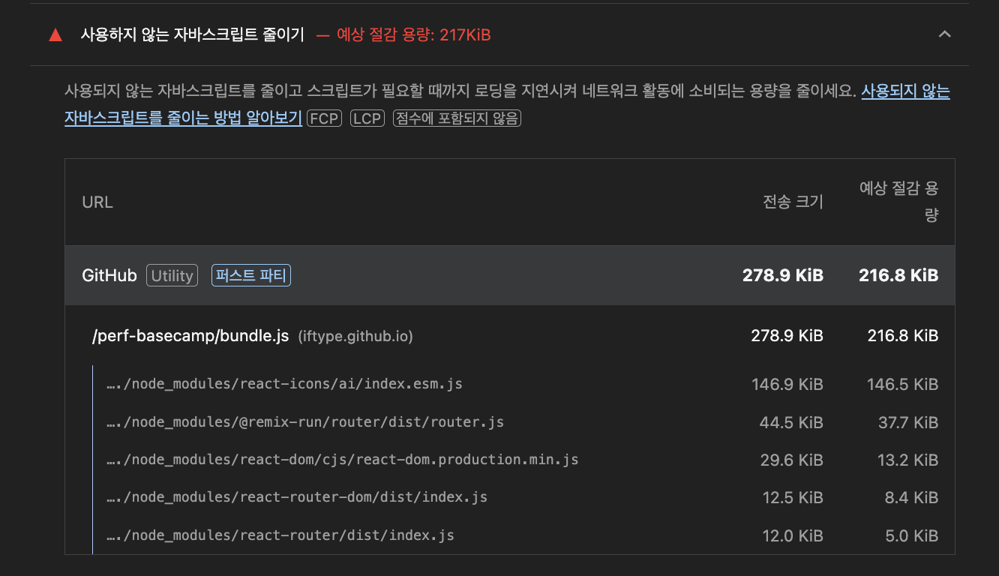

- 변겅 전

```tsx
import Home from './pages/Home/Home';
import Search from './pages/Search/Search';
//...
```

- 변경 후

```tsx
import Home from './pages/Home/Home';
import Search from './pages/Search/Search';
//...
```

```tsx
const Home = lazy(() => import('./pages/Home/Home'));
const Search = lazy(() => import('./pages/Search/Search'));

const App = () => {
  return (
    // 추가
    <Suspense fallback={null}>
      <--생략-->
    </Suspense>
  );
};
```

lazy와 Suspense를 사용하여 페이지 단위로 청크를 나눠 페이지를 비동기로 로드했습니다.

이로서 초기 렌더링 시 Search 페이지를 로드하지않아 첫 진입시의 퍼포먼스를 개선할 수 있었습니다.

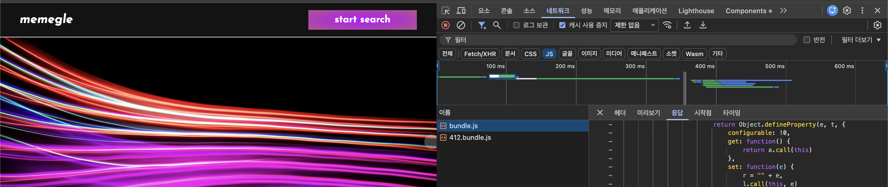
네트워크 탭에서 Search 페이지로 진입 시 새로 번들을 요청하는 것을 확인할 수 있습니다.

#### 3. 번들 사이즈 줄이기(css)

`style-loader`는 CSS 삽입을 위한 런타임 코드가 JavaScript 번들에 포함되게 함으로 번들 크기를 줄이기 위해 최적화 플러그인을 설치해줬습니다.

```js
// webpack.config.js
const CssMinimizerPlugin = require('css-minimizer-webpack-plugin');
const MiniCssExtractPlugin = require('mini-css-extract-plugin');
```

`mini-css-extract-plugin` : JavaScript 번들 안에 포함되던 CSS를 별도의 .css 파일로 추출할 수 있게함
`css-minimizer-webpack-plugin` :CSS를 압축해줌, 위 플러그인을 사용해서 별도의 .css 파일로 추출해서 사용 가능

추가 내용
Home 페이지까지 Layz 로딩을 하고있어서 두 번들을 불러오기 때문에 최적화가 되고있지 않았습니다..

// 변경 전

```js
const Home = lazy(() => import('./pages/Home/Home'));

// 변경 후
import Home from './pages/Home/Home';
```

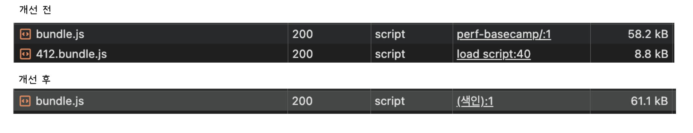

총 번들크기가 66KB 에서 61.1KB로 줄일 수 있었습니다

#### 4. 이미지 최적화(확장자 변환)

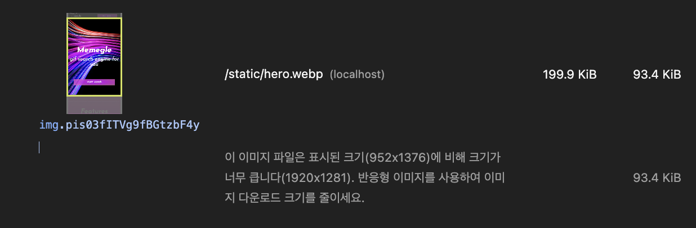
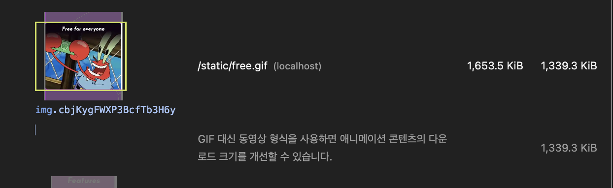

라이트하우스의 조언에 따라 이미지와 gif의 확장자를 변경했다.

##### 이미지

```bash

# 변환 전
❯ ls -lh src/assets/images/hero.png
-rw-r--r--@ 1 iftype  staff    10M Sep 16 15:50 src/assets/images/hero.png

# 변환 후
-rw-r--r--@ 1 iftype  staff   200K Sep 20 11:57 src/assets/images/hero.webp

```

현재 히어로 이미지는 10M으로 너무 크다고 생각해 webp로 변환하여 200kb까지 줄일 수 있었습니다

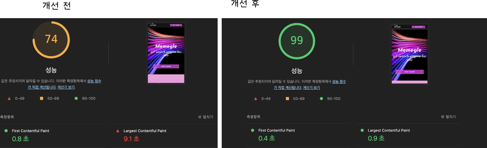

그 결과 성능을 98점까지 올릴 수 있었습니다.

##### GIF

```tsx
interface FeatureItemProps {
  title: string;
  type: 'gif' | 'mp4';
  src: string;
}
```

```tsx
type === 'gif' ? (
  
) : (
  <video className={styles.featureImage} autoPlay loop playsInline muted preload="metadata">
    <source src={src} type="video/mp4" />
  </video>
);
```

GIF 이미지도 영상으로 변경하여 넣어줬습니다. 이미지만 받고있던 `FeatureItem` 컴포넌트에서 비디오도 받을 수 있도록 변경하였습니다.

gif와 동일한 기능을 하기위해 자동재생, 루프를 사용했고 autoplay를 사용하고 있기 때문에 preload 속성이 제대로 동작하진 않지만 의도를 드러내기 위해 사용했습니다.

##### 개선 이후

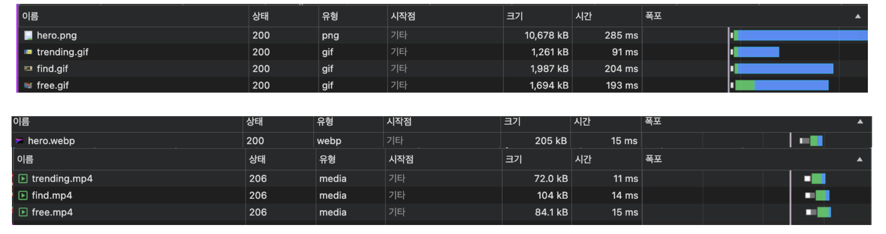

개선 이후 눈에 띄게 크기와 콘텐츠 다운로드가 줄어들었습니다.

##### Webp 파일 자동으로 생성

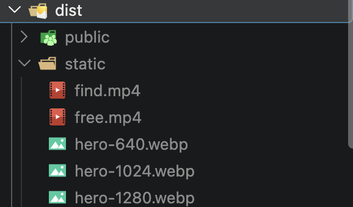

```js
// webpack.config.js
      {
        test: /\.(png|jpg)$/i,
        resourceQuery: /webp/,
        use: {
          loader: 'responsive-loader',
          options: {
            adapter: require('responsive-loader/sharp'),
            sizes: [640, 1280],
            format: 'webp',
            quality: 70,
            name: 'static/[name]-[width].[ext]',
            esModule: false
          }
        }
      },
```

Webp 파일이 구형 브라우저에 적용되지 않을 수 있다는 정보를 알게되어 png 파일을 fallback 시 사용하도록 해줬습니다.

```ts
import heroImage from '../../assets/images/hero.png?webp';
```

resourceQuery 를 이용하여 의존성을 가져오는 부분에서 `?webp`를 사용한 이미지 파일에 대해서 빌드 시 640, 1280 사이즈로 webp파일을 생성하게 해줬습니다.

```tsx
// Home.tsx

import heroImage from '../../assets/images/hero.png?webp';
import heroFallback from '../../assets/images/hero.png';
```

홈에서 생성된 webp 히어로이미지와 폴백 이미지를 불러와서

```tsx
// ResponsiveImage.tsx
<picture>
  <source srcSet={image.srcSet} sizes={sizes} type="image/webp" />
  
</picture>
```

우선적으로 webp를 사용하게 해줬고 브라우저가 지원하지 않는다면 fallback을 사용하도록 해줬습니다. 그리고 SrcSet을 사용해 미리 기종별 사이즈로 생성해둔 webp파일을 브라우저가 선택할 수 있게 전달해줬습니다.

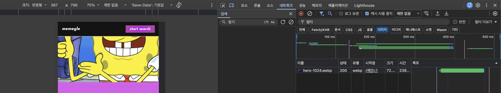

`window.devicePixelRatio` 가 2고, width가 350px인 환경에서 1024이미지를 가져온 것을 확인했습니다.

+추가
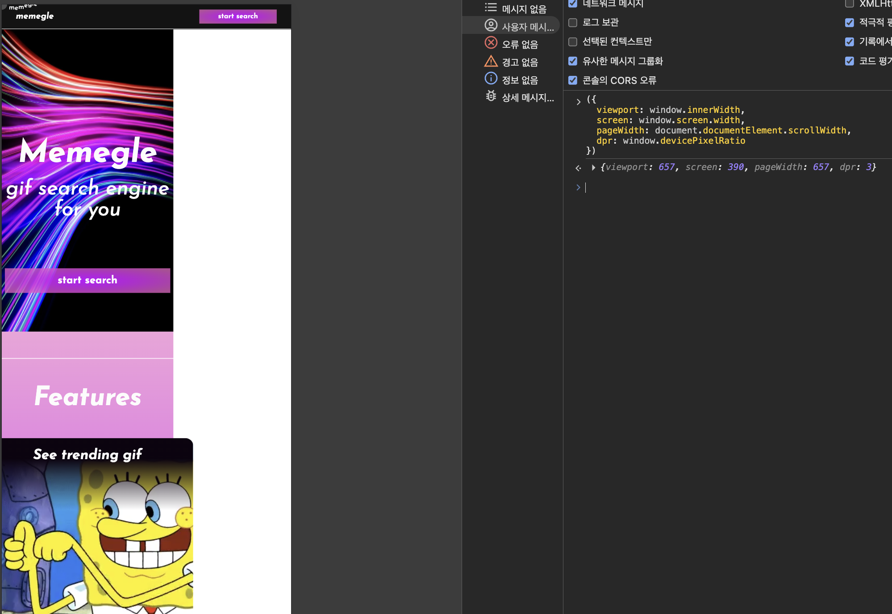
모바일 환경에서 스크롤 애니메이션과 헤더, 버튼 때문에 뷰포트와 스크린이 다르게 나오는 문제가 있어, 부모의 가로길이를 따르도록 스타일을 수정했습니다.

##### 우선순위 설정 - preload

```html
<link
  rel="preload"
  as="image"
  href="./static/hero-1280.webp"
  imagesrcset="
    ./static/hero-640.webp 640w,
    ./static/hero-1024.webp 1024w,
    ./static/hero-1280.webp 1280w
  "
  imagesizes="100vw"
  type="image/webp"
  fetchpriority="high"
/>
```

`index.html`에서 히어로 이미지를 우선적으로 불러오게했습니다.

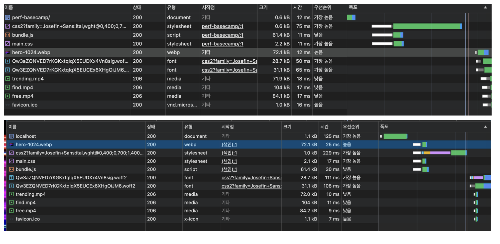
번들이후 React의 ``요소를 확인하여 요청을 시작했다면 preload 적용 이후에는 초기 `index.html`에서 발견될 수 있도록하여 `bundle` 과 같이 병렬적으로 불러오게 만들었습니다.

#### 5. API 응답 캐싱

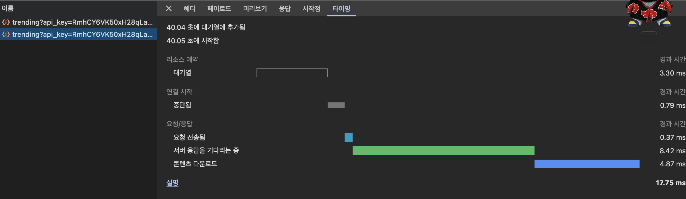

Search 에서 새로고침이나 홈을 갔다올때마다 API를 불러오고 있었습니다. API의 양도 어마무시하여 캐시하기로했습니다.

캐시는 서버가 없는 저의 상황에 인메모리와 브라우저의 스토리지를 고려하였는데요, 어차피 키값도 번들안에 노출되었겠다, 캐시 스토리지를 쓰기로 결정했습니다.

로컬스토리지를 고려하지 않은 이유는 응답량이 너무 커서(10.5KB) 동기로 작동하는 로컬스토리지에선 요청을 받는 시간동안 프레임 드랍이 일어날 것 같았습니다.
그런데 제가 아는 캐시 스토리지에선 응답값을 그대로 저장하여 활용하는 것으로 알고 있었는데, 오래동안 사용할 서비스가 아니라고 판단하여 기존 코드에 있는 `fetchGifs`를 활용해서 변환된 모델만 저장하게 했습니다.

```ts
// apis/gifAPIServices.ts

// 찾기로직

const getTrendingCacheName = (): string =>
  `trending-cache-${new Date().toLocaleDateString('ko-KR')}`;

// 삭제로직

const deleteOutdatedCaches = async (currentCacheName: string): Promise<void> => {
  const cacheNames = await caches.keys();

  await Promise.all(
    cacheNames
      .filter((name) => name !== currentCacheName)
      .map(async (name) => await caches.delete(name))
  );
};
```

캐시 이름을 오늘 날짜로 설정하여 TTL을 대체했고, 삭제로직을 추가해 캐시히트 실패시 다른 캐시들까지 정리하도록 했습니다. 다른 API 응답들을 캐싱할 계획도 없어서 모든 항목들을 삭제해도 되겠다고 생각했습니다.
